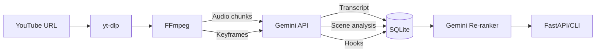

# Video Analyzer (Simplified - Gemini API)

Use **Gemini API free tier** to replace multiple local models with one unified AI for transcription, vision, and reasoning.

## Key Simplification

| Before (Complex) | After (Gemini) |
|------------------|----------------|
| Whisper (transcription) | Gemini 2.0 Flash |
| YOLO (object detection) | Gemini Vision |
| CLIP (semantic search) | Gemini Vision |
| Ollama/Llama (reasoning) | Gemini |
| ChromaDB (vectors) | SQLite + Gemini Re-ranking |

> [!TIP]
> **Free Tier Limits** (Gemini 2.0 Flash): 15 RPM, 1M tokens/day, 1500 req/day

> [!WARNING]
> **YouTube Analytics API Limitation**: Retention/engagement data (watch time, audience retention curves) is only available to channel owners via OAuth. This app detects hooks through **content analysis**, not YouTube metrics.

---

## Architecture



---

## Project Structure

```
src/video_analyzer/
├── __init__.py
├── config.py              # Settings (API key, paths, rate limits)
├── cli.py                 # Typer CLI
│
├── ingestion/
│   ├── __init__.py
│   ├── downloader.py      # yt-dlp wrapper + metadata extraction
│   └── processor.py       # FFmpeg (audio chunks + keyframe extraction)
│
├── analyzer/
│   ├── __init__.py
│   ├── gemini.py          # Gemini client + rate limiter + retry logic
│   ├── transcribe.py      # Audio → text (chunked for long videos)
│   ├── vision.py          # Frame analysis + scene detection
│   └── hooks.py           # Hook detection via content analysis
│
├── search/
│   ├── __init__.py
│   └── reranker.py        # Gemini re-ranking for semantic search
│
├── storage/
│   ├── __init__.py
│   ├── database.py        # SQLite operations
│   ├── models.py          # SQLModel data models
│   └── media.py           # Local file management (data/ folder)
│
└── api/
    ├── __init__.py
    └── routes.py          # FastAPI endpoints
```

---

## Local Storage Structure

```
data/
└── {video_id}/
    ├── video.mp4          # Original (optional, can delete after processing)
    ├── audio.mp3          # Extracted audio
    ├── frames/
    │   ├── 0001.jpg       # Keyframes at 0.2 fps (1 per 5 seconds)
    │   └── ...
    ├── transcript.json    # Timestamped transcript
    └── analysis.json      # Cached Gemini analysis results
```

---

## Hook Detection Strategy

Since YouTube retention data is not publicly accessible, hooks are detected through **content analysis**:

### Visual Hooks (Gemini Vision)
- Scene changes / jump cuts
- Text overlays appearing
- Face close-ups / emotion shifts
- High motion intensity

### Audio Hooks (Gemini Audio)
- Energy/tone shifts
- Music drops or transitions
- Silence → speech patterns
- Questions posed to viewer

### Content Patterns (Gemini Reasoning)
- Pattern interrupts ("But here's the thing...")
- Open loops / cliffhangers
- First 30 seconds analysis (thumbnail-title-hook alignment)
- Contrast and surprise elements

---

## Rate Limiting Strategy

| Constraint | Strategy |
|------------|----------|
| 15 RPM | Token bucket rate limiter with 4s minimum between requests |
| 1500 req/day | Track daily usage in SQLite, warn at 80% |
| ~20MB audio limit | Chunk audio into 10-minute segments |
| Frame processing | 0.2 fps = 12 frames/minute, batch analyze where possible |

---

## Core Components

### Dependencies

```toml
[project]
name = "video-analyzer"
version = "0.1.0"
requires-python = ">=3.11"
dependencies = [
    "google-genai>=1.0.0",        # Gemini API
    "yt-dlp>=2024.1.0",           # YouTube download
    "fastapi>=0.109.0",           # API
    "uvicorn[standard]>=0.27.0",
    "typer>=0.9.0",               # CLI
    "sqlmodel>=0.0.14",           # Database ORM
    "pydantic-settings>=2.1.0",   # Config management
    "httpx>=0.26.0",              # HTTP client
    "pillow>=10.2.0",             # Image processing
    "rich>=13.7.0",               # CLI output
    "tenacity>=8.2.0",            # Retry logic
]
```

> [!NOTE]
> Using `subprocess` for FFmpeg instead of `ffmpeg-python` (unmaintained since 2022).

---

## Implementation Order

1. **Config & Settings** - `config.py` with Pydantic settings, API key validation
2. **Database Models** - `models.py` (Video, Transcript, Frame, Hook, Moment)
3. **Database Operations** - `database.py` with SQLite setup
4. **Media Storage** - `media.py` for local file management
5. **Downloader** - `downloader.py` with yt-dlp wrapper
6. **Processor** - `processor.py` for audio extraction + keyframe sampling
7. **Gemini Client** - `gemini.py` with rate limiting, retries, quota tracking
8. **Transcription** - `transcribe.py` (handle audio chunking)
9. **Vision Analysis** - `vision.py` with batch processing
10. **Hook Detection** - `hooks.py` using transcript + vision data
11. **Re-ranker** - `reranker.py` for semantic search
12. **CLI** - `cli.py` with Typer commands
13. **API** - `routes.py` (can defer to v0.2)

---

## CLI Usage

```bash
# Analyze YouTube video
video-analyzer analyze https://youtube.com/watch?v=XXX

# Find hooks in analyzed video
video-analyzer hooks <video-id>

# Search across videos (with Gemini re-ranking)
video-analyzer search "person holding coffee"

# List analyzed videos
video-analyzer list

# Show quota usage
video-analyzer quota
```

---

## Verification Plan

```bash
# Test with short sample video (< 5 min recommended for testing)
python -m video_analyzer.cli analyze "https://youtube.com/watch?v=dQw4w9WgXcQ"

# Check results
python -m video_analyzer.cli list
python -m video_analyzer.cli hooks <id>
python -m video_analyzer.cli search "music"
```

---

## Environment Setup

```bash
# Required
export GEMINI_API_KEY="your-api-key"

# System dependencies (macOS)
brew install ffmpeg

# System dependencies (Ubuntu/Debian)
sudo apt install ffmpeg
```
